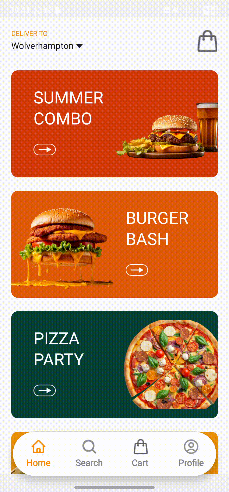

# Food Ordering Application

A mobile food ordering application built with **React Native** and **Expo**. The application allows users to browse a menu, search for dishes, filter by category, view item details in a modal, and add customized items to a cart. Users can securely place orders with integrated **Stripe** payment processing.

## Demo



## Features

- Shopping cart with item details and quantities
- Item detail modal with customisations
- Search functionality for menu items
- Category-based filtering
- Offer cards that map directly to menu items
- Stripe payment integration for secure checkout
- State management for cart and user data using Zustand
- Responsive and performant mobile interface
- Backend built with Node.js, Express, and MongoDB
- Custom user authentication and order management

---

## Technology Stack

- **React Native** – UI and application logic
- **Expo Router** – Navigation and routing
- **Zustand** – Global state management
- **Appwrite** – Backend service for media assets
- **TypeScript** – Type safety and maintainability
- **Node.js & Express** – Custom backend APIs for orders and authentication
- **MongoDB** – Database for persistent user and order data
- **Stripe** – Payment processing

---

## Installation

1. Clone the repository:

   ```bash
   git clone https://github.com/your-username/food-ordering-app.git
   cd food-ordering-app

   ```

2. install dependecies with npm

3. start expo server with
   'npx expo start'

4. run application with Expo Go on mobile by scanning qr code
